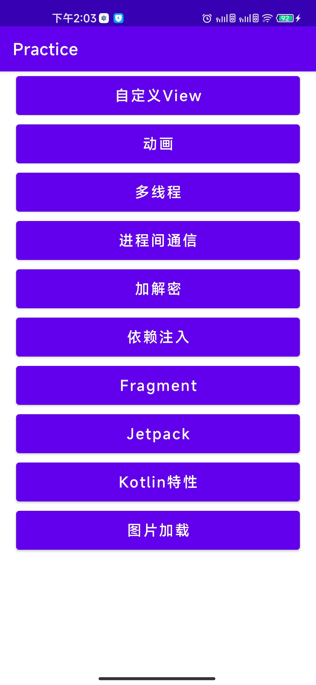
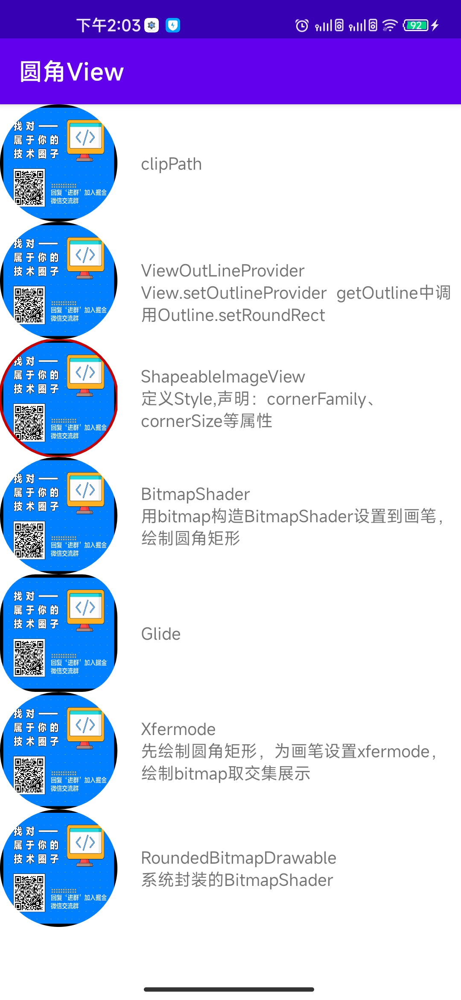
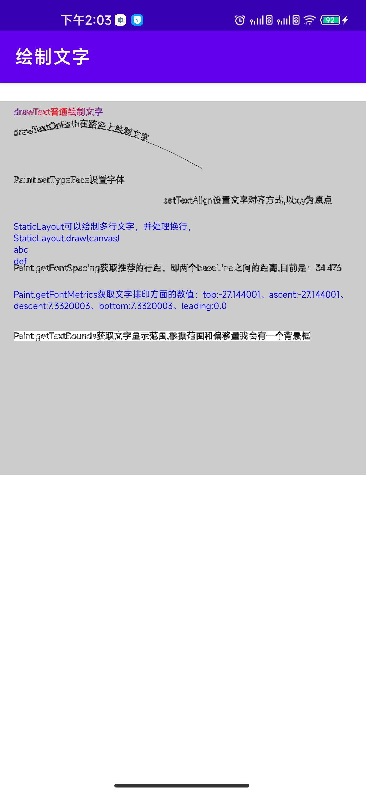
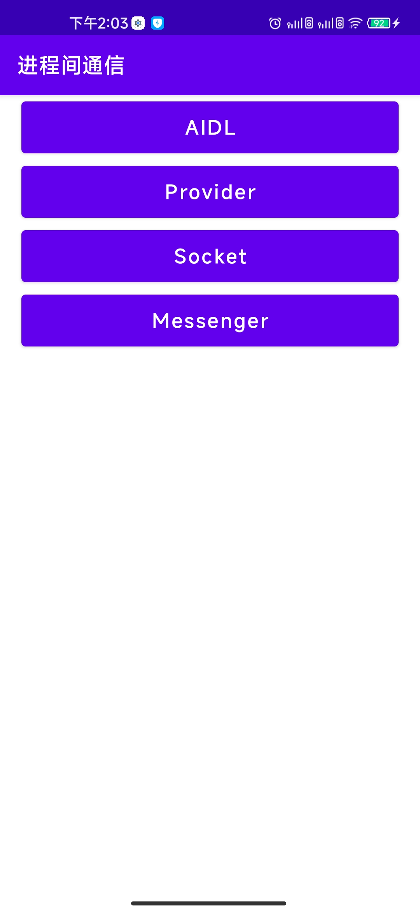
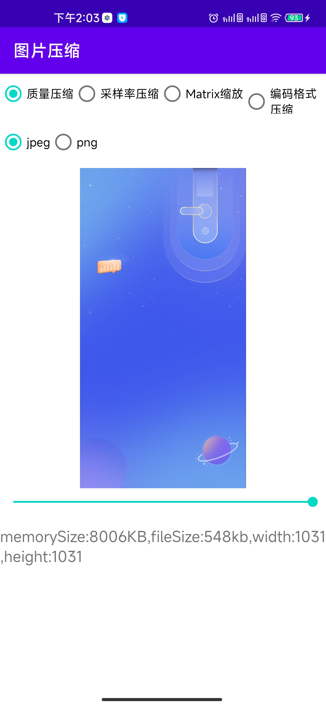

# Android关联知识点练习

## 已涵盖内容：

* Java基础
  * 多线程
* Kotlin
  * Flow
  * 协程
* 进程间通信
  * AIDL
  * Messenger
  * Socket
  * Provider
* 自定义View
  * 圆角ImageView
  * 滑动
  * canvas
* Jetpack
  * LiveData
  * LifeCycle
  * ViewModel
* 图片加载
  * 图片压缩
* 动画
  * MotionLayout

## 截图
|  |  |  |
| --------------------- | --------------------- | ----------------------|
|  |  |  |

